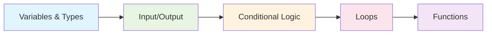

# 🐍 Python for Data Structures & Algorithms

<div align="center">


*Master Python fundamentals essential for Data Structures & Algorithms*

**🚀 From Zero to DSA Hero | 🎯 34 Core Topics | 💻 Competitive Programming Ready**

</div>

---

## 🎯 Why This Guide?

When starting your **Data Structures & Algorithms** journey, you don't need to master all of Python. This curated guide covers **only the Python concepts you need** to excel in:

- 🏆 **Competitive Programming** (Codeforces, AtCoder, CodeChef)
- 💼 **Technical Interviews** (Google, Amazon, Microsoft, Meta)
- 📚 **LeetCode & HackerRank** problems
- 🎓 **Academic DSA courses**

### 🌟 What Makes This Different?

- ✅ **DSA-Focused**: Every topic directly applies to algorithm problems
- ⚡ **Fast Track**: Skip unnecessary concepts, focus on essentials
- 🎯 **Interview Ready**: Covers syntax patterns used in coding interviews
- 📝 **Quick Reference**: Perfect for competitive programming contests

---

## 📊 Learning Roadmap

### 🚀 **Phase 1: DSA Foundations** (Days 1-7)
*Essential concepts you'll use in 90% of algorithm problems*



| Priority | Topic | DSA Application | Time |
|----------|-------|-----------------|------|
| 🔥 **CRITICAL** | [Variables ❎](#2-variables-) | Store problem inputs, counters | 30 min |
| 🔥 **CRITICAL** | [Type Casting 💱](#3-type-casting-) | Handle different input types | 20 min |
| 🔥 **CRITICAL** | [User Input ⌨️](#4-user-input-) | Read test cases, interactive problems | 15 min |
| 🔥 **CRITICAL** | [If Statements 🤔](#6-if-statements-) | Conditional logic in algorithms | 45 min |
| 🔥 **CRITICAL** | [Loops 🔁](#13-for-loops-) | Iterate through data structures | 60 min |
| 🔥 **CRITICAL** | [Functions 📞](#19-functions-) | Modular code, recursive solutions | 45 min |

### 🏗️ **Phase 2: Data Structure Mastery** (Days 8-14)
*Core data structures for algorithm implementation*

| Priority | Topic | DSA Application | Time |
|----------|-------|-----------------|------|
| 🔥 **CRITICAL** | [Lists, Sets, Tuples 🍎](#15-lists-sets-and-tuples-) | Arrays, dynamic programming, graphs | 90 min |
| 🔥 **CRITICAL** | [Dictionaries 📙](#17-dictionaries-) | Hash maps, frequency counting | 60 min |
| 🔥 **CRITICAL** | [String Methods 〰️](#9-string-methods-) | String algorithms, pattern matching | 45 min |
| 🔥 **CRITICAL** | [2D Collections ⬜](#16-2d-collections-) | Matrices, grids, dynamic programming | 60 min |
| ⚡ **HIGH** | [List Comprehensions 📃](#25-list-comprehensions-) | Concise data transformation | 30 min |
| ⚡ **HIGH** | [Membership Operators 🔎](#24-membership-operators-) | Fast lookups, existence checks | 15 min |

### 🎓 **Phase 3: Advanced Concepts** (Days 15-21)
*Advanced features for complex algorithms*

| Priority | Topic | DSA Application | Time |
|----------|-------|-----------------|------|
| ⚡ **HIGH** | [*args & **kwargs 📦](#22-args--kwargs-) | Flexible function signatures | 30 min |
| ⚡ **HIGH** | [Exception Handling 🚦](#34-exception-handling-) | Robust code, edge case handling | 45 min |
| 📚 **MEDIUM** | [OOP Basics 🚗](#30-python-object-oriented-programming-) | Complex data structures | 60 min |
| 📚 **MEDIUM** | [Inheritance 👨‍👦‍👦](#32-inheritance-) | Advanced data structure implementations | 45 min |
| 🎯 **BONUS** | [Modules 📨](#27-modules-) | Code organization, libraries | 30 min |

---

## 🏆 DSA Topic Mapping

### 🔍 **Which Python Concepts for Which DSA Topics?**

<details>
<summary>📊 <strong>Arrays & Lists</strong></summary>

**Essential Python Skills:**
- [Lists, Sets, Tuples 🍎](#15-lists-sets-and-tuples-) - Array operations
- [For Loops 🔁](#13-for-loops-) - Iteration patterns  
- [List Comprehensions 📃](#25-list-comprehensions-) - Transformations
- [2D Collections ⬜](#16-2d-collections-) - Matrix problems

**Common Patterns:**
```python
# Two pointers
left, right = 0, len(arr) - 1

# Sliding window
for i in range(len(arr) - k + 1):
    window = arr[i:i+k]

# Matrix traversal
for i in range(len(matrix)):
    for j in range(len(matrix[0])):
        # Process matrix[i][j]
```
</details>

<details>
<summary>🔗 <strong>Linked Lists</strong></summary>

**Essential Python Skills:**
- [OOP Basics 🚗](#30-python-object-oriented-programming-) - Node classes
- [Functions 📞](#19-functions-) - Recursive operations
- [Conditional Logic 🤔](#6-if-statements-) - Null checks

**Implementation Pattern:**
```python
class ListNode:
    def __init__(self, val=0, next=None):
        self.val = val
        self.next = next
```
</details>

<details>
<summary>🌳 <strong>Trees & Graphs</strong></summary>

**Essential Python Skills:**
- [Dictionaries 📙](#17-dictionaries-) - Adjacency lists
- [Sets](#15-lists-sets-and-tuples-) - Visited tracking
- [Recursion (Functions)](#19-functions-) - Tree traversals
- [2D Collections](#16-2d-collections-) - Grid graphs

**Graph Representation:**
```python
# Adjacency list
graph = {1: [2, 3], 2: [4], 3: [4], 4: []}

# DFS with recursion
def dfs(node, visited):
    if node in visited:
        return
    visited.add(node)
    for neighbor in graph[node]:
        dfs(neighbor, visited)
```
</details>

<details>
<summary>⚡ <strong>Dynamic Programming</strong></summary>

**Essential Python Skills:**
- [2D Collections ⬜](#16-2d-collections-) - DP tables
- [Functions 📞](#19-functions-) - Recursive relations
- [Dictionaries 📙](#17-dictionaries-) - Memoization

**DP Patterns:**
```python
# Memoization
memo = {}
def dp(i, j):
    if (i, j) in memo:
        return memo[(i, j)]
    # Compute result
    memo[(i, j)] = result
    return result

# Tabulation
dp = [[0] * n for _ in range(m)]
```
</details>

<details>
<summary>🔍 <strong>Searching & Sorting</strong></summary>

**Essential Python Skills:**
- [Arithmetic & Math 📐](#5-arithmetic--math-) - Binary search calculations
- [While Loops ♾️](#12-while-loops-) - Search algorithms
- [List Methods](#15-lists-sets-and-tuples-) - Built-in sorting

**Binary Search Template:**
```python
def binary_search(arr, target):
    left, right = 0, len(arr) - 1
    while left <= right:
        mid = (left + right) // 2
        if arr[mid] == target:
            return mid
        elif arr[mid] < target:
            left = mid + 1
        else:
            right = mid - 1
    return -1
```
</details>

---

## 🎯 Quick Start for DSA

### ⚡ **15-Minute Quick Setup**
```python
# 1. Essential imports for competitive programming
import sys
from collections import defaultdict, deque, Counter
from heapq import heappush, heappop
import math

# 2. Fast I/O for competitive programming
input = sys.stdin.readline

# 3. Common templates
def solve():
    n = int(input())
    arr = list(map(int, input().split()))
    # Your solution here

# 4. Multiple test cases
t = int(input())
for _ in range(t):
    solve()
```

### 🏆 **Competitive Programming Essentials**

**Input Patterns:**
```python
# Single integer
n = int(input())

# Multiple integers in one line  
a, b, c = map(int, input().split())

# List of integers
arr = list(map(int, input().split()))

# Multiple test cases
for _ in range(int(input())):
    # Solution code
```

**Output Patterns:**
```python
# Single result
print(result)

# Multiple results
print(*results)  # Space-separated
print('\n'.join(map(str, results)))  # Line-separated
```

---

## 📚 Topic Difficulty & Time Investment

### 🟢 **Beginner Level** (Master First)
| Topic | Time Required | Difficulty | DSA Usage |
|-------|---------------|------------|-----------|
| Variables ❎ | 15 min | ⭐ | Every problem |
| Type Casting 💱 | 10 min | ⭐ | Input handling |
| If Statements 🤔 | 30 min | ⭐ | Logic flow |
| Loops 🔁 | 45 min | ⭐⭐ | Iteration |
| Lists 🍎 | 60 min | ⭐⭐ | Array problems |
| Functions 📞 | 45 min | ⭐⭐ | Code organization |

### 🟡 **Intermediate Level** (Build Proficiency)
| Topic | Time Required | Difficulty | DSA Usage |
|-------|---------------|------------|-----------|
| Dictionaries 📙 | 45 min | ⭐⭐ | Hash maps |
| String Methods 〰️ | 30 min | ⭐⭐ | String algorithms |
| 2D Collections ⬜ | 60 min | ⭐⭐⭐ | Matrix problems |
| List Comprehensions 📃 | 30 min | ⭐⭐ | Data transformation |
| Exception Handling 🚦 | 30 min | ⭐⭐ | Robust code |

### 🔴 **Advanced Level** (Master Later)
| Topic | Time Required | Difficulty | DSA Usage |
|-------|---------------|------------|-----------|
| OOP 🚗 | 90 min | ⭐⭐⭐ | Complex structures |
| Inheritance 👨‍👦‍👦 | 45 min | ⭐⭐⭐ | Advanced implementations |
| Polymorphism 🎭 | 60 min | ⭐⭐⭐⭐ | System design |

---

## 🔧 Development Environment Setup

### 🚀 **Recommended Setup for DSA**

**IDE Options:**
- **VS Code** - Lightweight, excellent Python support
- **PyCharm** - Full-featured, great for debugging  
- **Sublime Text** - Fast, competitive programming friendly
- **Online**: Replit, CodePen (for quick testing)

**Essential Extensions (VS Code):**
- Python (Microsoft)
- Python Docstring Generator
- Bracket Pair Colorizer
- Code Runner

**Competitive Programming Setup:**
```python
# template.py - Your competitive programming template
import sys
from collections import defaultdict, deque, Counter
from heapq import heappush, heappop, heapify
import math, bisect

def main():
    # Fast I/O
    input = sys.stdin.readline
    
    # Your solution here
    pass

if __name__ == "__main__":
    main()
```

---

## 🎯 Practice Strategy

### 📈 **Week-by-Week Plan**

**Week 1: Python Fundamentals**
- Day 1-2: Variables, input/output, basic operations
- Day 3-4: Conditionals and loops
- Day 5-7: Functions and basic data structures

**Week 2: Data Structure Deep Dive**  
- Day 1-3: Lists and arrays (implement common algorithms)
- Day 4-5: Dictionaries and sets (hash-based problems)
- Day 6-7: 2D arrays and matrix problems

**Week 3: Algorithm Application**
- Day 1-2: String algorithms using Python string methods
- Day 3-4: Basic OOP for complex data structures  
- Day 5-7: Practice problems combining multiple concepts

### 🏆 **Practice Platforms by Difficulty**

**Beginner:**
- [Python.org Tutorial](https://docs.python.org/3/tutorial/)
- [HackerRank Python Domain](https://www.hackerrank.com/domains/python)
- [Codewars](https://www.codewars.com/) (Python Fundamentals)

**Intermediate:**
- [LeetCode Easy Problems](https://leetcode.com/)
- [GeeksforGeeks Python](https://www.geeksforgeeks.org/python-programming-language/)
- [AtCoder Beginner Contest](https://atcoder.jp/)

**Advanced:**
- [Codeforces](https://codeforces.com/)
- [LeetCode Medium/Hard](https://leetcode.com/)
- [CodeChef](https://www.codechef.com/)

---

## 💡 DSA Success Tips

### 🧠 **Mental Models for Success**

**Think in Patterns:**
- **Iteration**: Use for/while loops for traversing
- **Conditions**: Use if/elif/else for decision making  
- **Storage**: Use lists for sequences, dicts for mappings
- **Transformation**: Use list comprehensions for data processing

**Debug Like a Pro:**
```python
# Add debug prints
def debug(*args):
    print("DEBUG:", *args)

# Use assertions for assumptions
assert len(arr) > 0, "Array should not be empty"

# Visualize data structures
from pprint import pprint
pprint(complex_data_structure)
```

### 🚀 **Optimization Techniques**

**Time Complexity Awareness:**
```python
# O(n) - Good
for item in items:
    process(item)

# O(n²) - Be careful
for i in items:
    for j in items:
        compare(i, j)

# O(1) lookup - Use dictionaries
lookup = {}  # Instead of searching in lists
```

**Space Complexity Optimization:**
```python
# Use generators for large datasets
def fibonacci():
    a, b = 0, 1
    while True:
        yield a
        a, b = b, a + b

# In-place operations when possible
arr.sort()  # Instead of sorted(arr)
```

---

## 📖 Additional Resources

### 📚 **Books for DSA with Python**
- **Cracking the Coding Interview** - Gayle McDowell
- **Elements of Programming Interviews in Python** - Aziz, Lee, Prakash
- **Python Algorithms** - Magnus Lie Hetland

### 🎥 **Video Resources**
- [Original Tutorial](https://youtu.be/ix9cRaBkVe0) - Bro Code
- **NeetCode** - Algorithm explanations with Python
- **Tech With Tim** - Python DSA tutorials
- **Abdul Bari** - Algorithm concepts

### 🌐 **Online Communities**
- **r/learnpython** - Beginner-friendly Python community
- **r/cscareerquestions** - Interview and career advice
- **Discord servers** - Real-time help and discussion
- **Stack Overflow** - Specific problem solutions

---

## 🎯 Success Checklist

Before you start solving DSA problems, make sure you can:

### ✅ **Core Programming Skills**
- [ ] Write functions with parameters and return values
- [ ] Use if/elif/else for conditional logic
- [ ] Write for and while loops confidently
- [ ] Handle user input and type conversion
- [ ] Debug using print statements

### ✅ **Data Structure Proficiency**  
- [ ] Create and manipulate lists (append, pop, slice)
- [ ] Use dictionaries for key-value storage
- [ ] Work with 2D lists (matrices)
- [ ] Understand when to use sets vs lists
- [ ] Apply list comprehensions for data transformation

### ✅ **Problem-Solving Ready**
- [ ] Read problem input in various formats
- [ ] Implement basic algorithms (search, sort)
- [ ] Handle edge cases and exceptions
- [ ] Write clean, readable code
- [ ] Optimize for time and space complexity

---

<div align="center">

## 🚀 Ready to Conquer DSA?

*"The best time to plant a tree was 20 years ago. The second best time is now."*

**Start with [Variables ❎](#2-variables-) and work your way up!**

---

### 🎯 Contributing & Credits

**Original Content**: [Bro Code](https://www.youtube.com/@BroCodez) | **Curated for DSA**: This Guide

Made with ❤️ for aspiring software engineers and competitive programmers


</div>